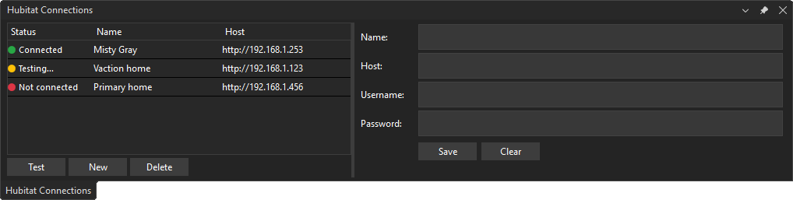
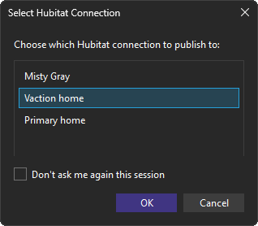
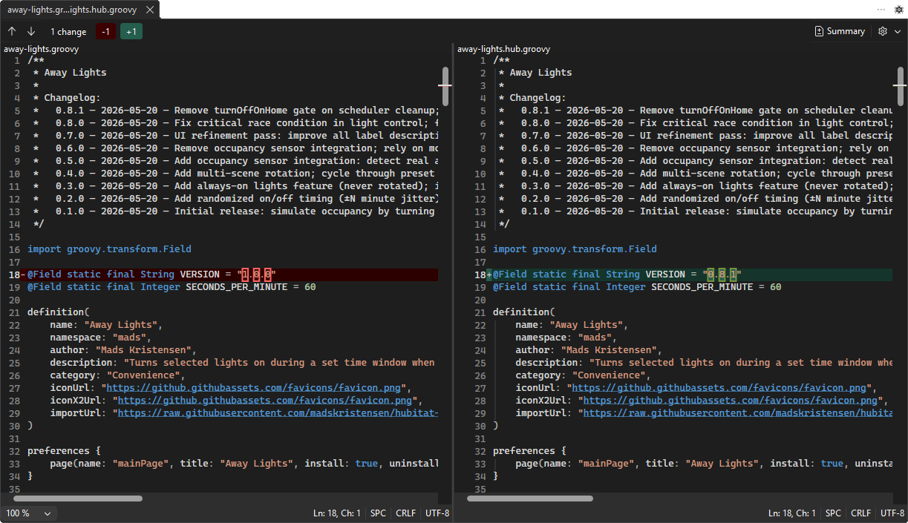

[marketplace]: <https://marketplace.visualstudio.com/items?itemName=MadsKristensen.HubitatVS>
[repo]: <https://github.com/madskristensen/HubitatVS>

# Hubitat Publish Tools for Visual Studio

Download this extension from the [Visual Studio Marketplace][marketplace].

## Overview

**Hubitat Publish Tools** is a Visual Studio extension that streamlines the development and publishing of Groovy-based drivers and apps for the Hubitat Elevation platform. Manage hub connections, classify Groovy source files, and publish drivers or apps directly from Visual Studio.

## ✨ Features

- **Hub Connection Management** — Configure and manage Hubitat hub connections from the Tools menu
- **Groovy Source Classification** — Detect whether a `.groovy` file is a Hubitat driver or app from its source structure
- **One-Click Publishing** — Publish drivers and apps directly to your Hubitat hub
- **Compare with Hub** — Diff your local Groovy file against the version currently on the hub using Visual Studio's built-in diff viewer
- **Connection Validation** — Verify hub connectivity before publishing
- **Build Integration** — Seamlessly integrated commands for Groovy projects

## Getting Started

1. Install the extension from the [Visual Studio Marketplace][marketplace]
2. Go to **Tools > Hubitat > Hub Connections** to configure your hub settings
3. Enter your hub IP address, maker API token, and authenticate
4. Right-click on a Hubitat `.groovy` file or use commands to publish it to your hub

If you have more than one connection defined, a dialog shows when you want to publish your driver or app, asking you to chose your connection.

## Compare with hub version

Right-click a Hubitat `.groovy` file in Solution Explorer and select **Compare with hub version** to diff your local file against the version currently deployed on the hub. Visual Studio's built-in diff viewer opens with the local file on the left and the hub version on the right, making it easy to review what has changed since your last publish.

The driver or app must have been published to the hub at least once before comparing.

## Support

For bug reports and feature requests, visit the [GitHub repository][repo].

Pull requests are welcome!
